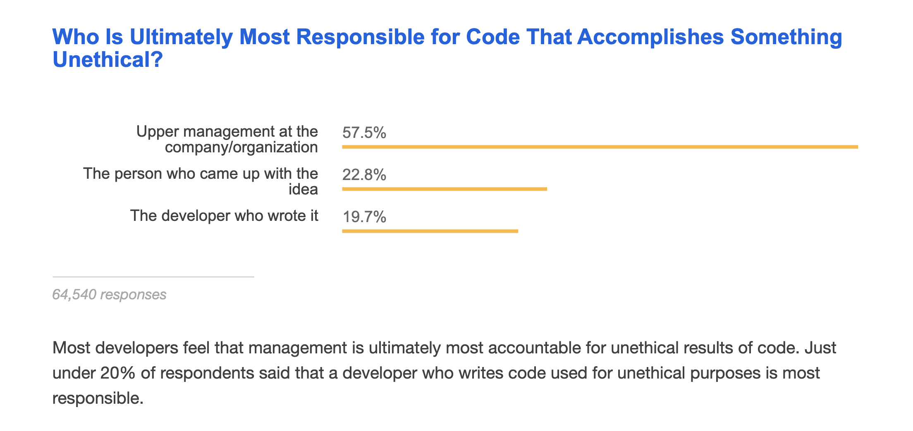

In ICS 314, I did not just learn about web application development, but all the methods required to be a successful in software engineering. Two of the most interesting things I learned in ICS 314 were *Agile Project Management*, and *Ethics in Software Engineering*. I will be discussing about these two topics below:

### What is Agile Project Management?
Agile project management is not just about speed, but also about integration and flexibility in the project. It is good for sudden changes in the plan, such as changing priorities, deferring tasks, and changing project characteristics as needed. Compared with traditional project management, it is a lightweight method. In other words, the entire project is divided into smaller steps, so that it is easier to apply changes without compromising the other aspects of the project.

#### The differences between agile and traditional methods

In traditional project management there is a time before the execution of the project intended for planning. 
It is when all specifications are defined. The characteristics of the project cannot be changed so easily.
Due to the way they are planned, traditional methods make it possible to deliver the project only once. 
That is, only one part of the project is done at a time and, at the end of the project, everything is gathered and sent.

In agile management, however, only the basics are decided at the beginning, and the project is defined over time, 
in an iterative way, there is an incentive for team collaboration as well. The characteristics of the final project
can be changed, if necessary, at any point in its execution without too much bureaucracy. Agile methods perform several
tasks at the same time, each person focus on an issue. Thus, the small issues can be approved throughout the execution of 
the project, so that everything is in good by the deadline.

### Ethics in Software Engineering
I have always been interested in the cultural and social aspects of technology, and recently, I have become 
concerned with the direction we are taking. There are many aspects in our lives that are improving with technology,
but there is also a dangerous direction that we are taking in politics, and in our society.

One of the biggest challenges is that we usually do not have a concrete answer to an ethical problem, this is very difficult
for software engineers, because they are used to think about things in the form of algorithms, in ways of writing code to 
create a solution, something that can be tested and predicted. But when we talk about ethics, we need to understand potential
consequences in society. It is comfortable to avoid such questions and focus on the things that we can solve. 

Software engineering is one of the most popular areas that we have these days, but it does not seem that the 
this area is assuming such social responsibility. There is a tendency to ignore the consequences of the software they 
make, seeing technology as something that is above the law, or simply not applicable. We have Facebook as an example 
that is not taking responsibility for fake news and hate speech that has been shared around the world. Or, the denial
of Airbnb's impact on the housing crisis in cities. To read more about Airbnb and the housing crisis:
[With Vacation Rentals Empty, European Cities See a Chance to Reclaim Housing](https://www.nytimes.com/2020/10/25/world/europe/airbnb-lisbon-housing.html).

*Developer Survey Results 2018 (StackOverflow)*

[Visit the Page](https://insights.stackoverflow.com/survey/2018/#technology-and-society)

