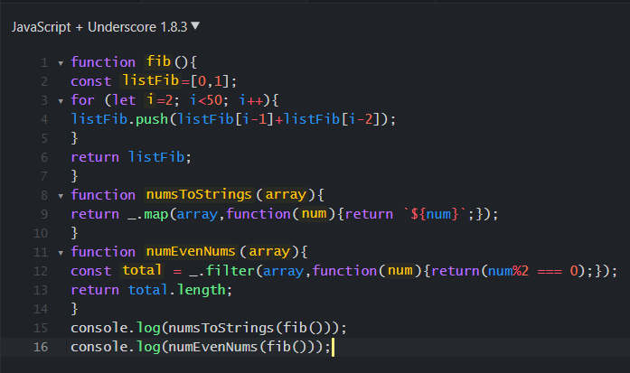
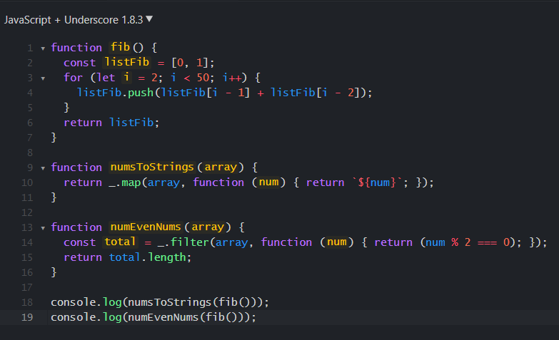

For a programmer, his source code is valuable, but for the company and team he works with, it
is even more valuable. In the world of software development, code cannot simply be considered 
correct for doing what it is supposed to do. Other aspects must be considered in the process,
such as readability. Software developers should ideally value keeping their
code readable and clean within specified standards. The code style can be viewed as an aesthetic
issue directly related to the taste of the developer. However, there are some styles adopted that
can benefit both the developer and others who may use the code developed. 

### Indentation 
The first aspect and the simplest of all is indentation. If not used properly, it will be very
hard to read and understand the code. Difficulties in understanding may compromise the learning
process for those who just started developing software. Even a highly skilled professional needs
to analyze calmly and with a lot of patience to understand an algorithm, even if it has few lines.
Now imagine a system with hundreds of them. Development without indentation is almost impossible.

#### BAD

#### GOOD

*Code from in-class WOD. "Five problems every software engineer should be able to solve (Part 3)", ICS 314*

We see that the same code is much more readable, and clean than the first one. 

### Well-Named

Use well-named functions, classes, and variables. A name should tell what it represents. It should
not be a single letter such as “x”, although it is acceptable for loops. It should not be a full 
sentence either. You want to be fast when you use them. 

### Avoid Long Lines
As we start getting more experience with programming, we end up wanting to perform numerous operations 
on a single line. It is faster, however, it directly affects the readability of the code and, therefore,
affects the performance during debugging. For example, I like to use spaces to help the visualization 
and avoid writing gigantic lines, always breaking them into two or three lines to make it as clear as possible.

Some people prefer to make their code short, writing long lines of code. I personally do not find it helpful.
You might save some extra lines here and there, but it can compromise your understanding. In general, I find 
it more valuable to calculate or call a function using a variable instead of directly returning the value, 
in this way I will not be confused about the return value. If there are too many lines together in a function,
it is possible to put an extra empty line to separate different functionalities. Ex: initialization, loops, a 
function call, etc.

### Comments 
While we understand our code today, in the future we might no longer remember the functionality of the algorithm
we wrote ourselves. Comments can explain the algorithm or logic used, showing the purpose of a variable, method,
class, etc. When creating a method or function, always try to write the purpose of the function and whether or not
it will return any information. It is not always possible to know by the name what information a variable will store
or what it will be used for, so be sure to comment on it in these cases. On the other hand, we know that exaggeration
can be equally bad. This issue applies to comments, which can make the code polluted visually, difficult to read.
Use common sense when commenting on the lines. I personally prefer writing blocks of comments rather than a single
line of comments for each line of code.

### ESLint
I recently started using ESLint with IntelliJ, and I found it to be extremely helpful. The reason I like this tool 
is that it not only warns us about code style issues but also warns us about the logical aspects of the code. For 
example, when the variable keeps its original value, it tells the user that he can use *const* instead of *let*. Another
thing I like about ESLint is that it emphasizes the use of spaces, making the code more readable, thus less trouble 
when trying to spot mistakes.

### Conclusion
Those small rules can make the code more readable, and life easier for us. You will have a hard time finding errors or
maintaining them if you do not code in a simple, clear, organized way and writing comments. Even if you program on your
own, you should adopt this good practice, and if you share the source with other people, it is mandatory, so others do 
not spend unnecessary time trying to understand the meaning of the code.

Of course, not all programming languages are the same, but there are many good practices that can be followed in the same
language. When we follow the coding style, we guarantee that everyone will have a minimal understanding of the code being developed,
even someone with the least knowledge of syntax. In view of this, it is recommended to always adopt the code style of the language being used.

