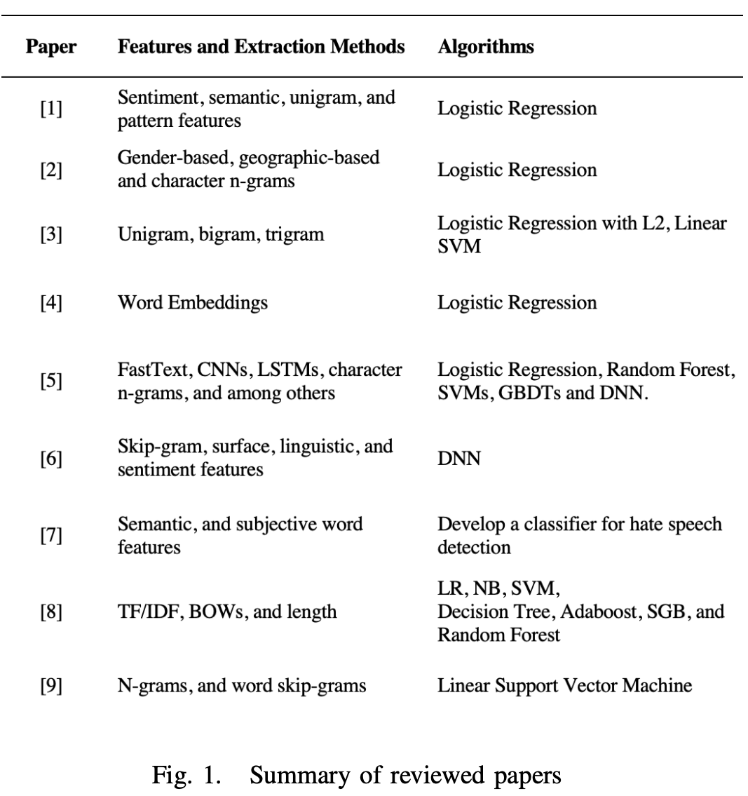

**Abstract**—Individuals who share hate speech tend to disguise their words with special characters or even sarcasm, thus making it a difficult task for basic algorithms to block such content. An efficient technique is needed to detect these speeches automatically as the volume of messages published daily increases and the task becomes unfeasible. The idea is to analyze various features, feature extraction techniques, and machine learning algorithms used by researchers to identify hate. Additionally, we will examine the limitations of various research methodologies as well as how certain textual characteristics may affect the categorization outcome. These methods will be compared to arrive at a conclusion that represents the state of the art in the detection of hate speech. The data examined by the authors comes directly from the Twitter API and Crowdflower.

## **I. INTRODUCTION**

Social media has brought a shift in relation to the way people communicate. It has been the stage for debates and the expression of personal opinions on various subjects. It enables people to voice their ideas freely and without any sort of face-to-face interaction. In general, we have the freedom to express ourselves without doing harm to another individual or a group. However, this doesn’t always happen in a polite and healthy manner. Hate speech, which occurs when someone expresses themselves in a way that discriminates against another person or group based on their characteristics, including sex, ethnicity, sexual orientation, and religion, among others, is one of the ways this freedom is abused.

&nbsp;&nbsp;&nbsp;&nbsp;&nbsp;&nbsp;&nbsp;Consequently, this ended up generating a phenomenon that is commonly seen in the online environment: the formation of communities of users who share the same ideology. In this way, people who spread hate speech strengthen their convictions and tend to group with others who share the same immoral ideas, such as racism, prejudice, violence, etc. Moreover, certain groups that promote hate online are even linked to terrorist attacks, suggesting that social media can contribute to violence. Important social media platforms have taken steps to solve this issue, either with the assistance of human reviewers or with the aid of some sort of automatic identification of abusive messages. However, misclassification between non-hateful, hateful and offensive speech is still very common in these cases.

##### II. STEPS OF HATE SPEECH DETECTION

###### A. Preprocessing Text

&nbsp;&nbsp;&nbsp;&nbsp;&nbsp;&nbsp;&nbsp;This is essential not only to turn them into structures that ML algorithms can understand, but also to enhance their performance by removing information that is not relevant. It is typical to combine numerous preprocessing methods. The most popular ones are converting words to low- ercase and eliminating stop words.

###### B. Features Selection

&nbsp;&nbsp;&nbsp;&nbsp;&nbsp;&nbsp;&nbsp;To effectively train a machine, you must deter- mine which aspects of specific data are crucial. Feature selection techniques aim to remove features based on some criteria, so that the classifier becomes more accurate.

###### C. Classification

&nbsp;&nbsp;&nbsp;&nbsp;&nbsp;&nbsp;&nbsp;The most relevant classification types for hate speech are binary and multiclass. Even though earlier studies used binary classes, the volume of profanity created a lot of false positives in the classification. Thus, nowadays it is more common to use a multiclass scheme with three classes: hate speech, offensive language, and neither.

##### III. DATA SOURCE

&nbsp;&nbsp;&nbsp;&nbsp;&nbsp;&nbsp;&nbsp;[1], [3] used data from Crowdflower, where tweets were manually categorized into one of three categories: offensive, neither offensive nor hate speech, or hate speech. For [3], Crowflower workers received a definition of hate speech along with a paragraph describing it in more details. They were instructed to consider the context in which they were used and that the use of bad language did not imply that a tweet contained hate speech. However, they seem to view phrases that are sexist and demeaning of women as merely offensive while viewing racist or homophobic language as hateful.

&nbsp;&nbsp;&nbsp;&nbsp;&nbsp;&nbsp;&nbsp;Overall, there is less consensus on labeling tweets as hate speech. The difficulty of being unanimous about the occurrences of hate speech suggests that human error is relatively high. This means that manually labelling tweets for training can produce biased outcomes and is frequently unreliable at recognizing abusive content. The other authors used a large amount of data from the Twitter API and Yahoo Finance website, instead of Crowflower.

##### IV. FEATURES AND FEATURE EXTRACTION METHODS

###### A. BOWs - Bag of Words

&nbsp;&nbsp;&nbsp;&nbsp;&nbsp;&nbsp;&nbsp;[8] used a combination of feature extraction methods, including BOWs. Interestingly, almost all the researchers analyzed comment on the limitations of BOW. This is particularly true in the context of hate speech, where offenders frequently employ clear yet efficient techniques to hide their remarks and make them harder for automatic detection (such as replacing or removing characters of offensive words) while keeping the intent clear to a human reader. Besides that, another disadvantage of this approach is the sparseness, since many words are not repeated from one tweet to another, which impairs the algorithm’s performance.

&nbsp;&nbsp;&nbsp;&nbsp;&nbsp;&nbsp;&nbsp;Moreover, simply counting words may not be discriminative enough and therefore not a good way to measure associations between words. Of- ten, words that occur a lot in a text may not offer high semantic meaning, while words that occur less often are more important. One fix for that is the TF-IDF algorithm used by [5] and [8]. It scales down the frequency of words throughout the text, penalizing words that appear more often. Lower weights are assigned to terms that appear in many documents. For example, the token ”a” may occur more frequently than other words, but without having great relevance to the context.

###### B. N-grams

&nbsp;&nbsp;&nbsp;&nbsp;&nbsp;&nbsp;&nbsp;[1], [2], [3], [5], [6], [9] used n-grams. [2] had better results when it used character n-grams of lengths up to 4. If there are no significant results between unigrams, bigrams, and trigrams, It is preferable to use only unigrams – as in [1], [3] – since bigrams and trigrams generate more at- tributes. It was demonstrated in those publications that n-grams and, more notably, character-level n- grams, are resistant to noisy datasets and may offer a solution to the social media spelling variation problem. Token and character n-gram features are extremely predictive, but combining them with other characteristics enhances performance even more. In view of this, we can assume that using n-grams alone isn’t the best way to distinguish between expressions of hate and those that don’t.

###### C. Word Embeddings

&nbsp;&nbsp;&nbsp;&nbsp;&nbsp;&nbsp;&nbsp;[4] used embeddings, which are vector representations that maintain the relationship between two semantically related words. It takes advantage of word order and states that words that are close in a sentence are also statistically more dependent. The vectorizations generated by techniques such as TF-IDF generate long sparse vectors, while dense vectors can be better to represent texts, as [4] was able to prove by getting a higher AUC value using paragraph2vec than the BOW (tf-idf) method.
Furthermore, word embedding learns the meanings of words, making it possible to capture con- text in a text. Word2vec can be implemented using two different architectures: continuous bag of words (CBOW) and skipgram. [6] uses the skipgram architecture. It has the advantage of vectorizing words as they appear and has better performance than CBOW in learning new words. However, it is more costly on larger datasets.

###### D. Others

&nbsp;&nbsp;&nbsp;&nbsp;&nbsp;&nbsp;&nbsp;Apart from the unigram feature, [1] also utilized sentiment-based, semantic-based, and pattern features. It turns out that sentiment analysis is not good for context. Writing patterns, on the other hand, are useful in identifying longer hateful phrases and sarcasm. The accuracy of the unigram and pattern features is the highest due to the pragmatic method. While semantic and sentiment- based features do not have good accuracy, they need to be combined with other features.

&nbsp;&nbsp;&nbsp;&nbsp;&nbsp;&nbsp;&nbsp;[2] also used gender-based, geographic-based features, and word n-grams. While gender provided a slightly better result—since men are more likely to be part of hate speech, location-based and word n-grams are harmful to the results. Location is often unreliable and unavailable on the internet, thus making it hard to use it as a feature. A new feature that can be considered is the author. This will allow us to discover the prevalence of offensive comments by the author, which can be used as additional evidence to filter out offensive text.

&nbsp;&nbsp;&nbsp;&nbsp;&nbsp;&nbsp;&nbsp;FastText, CNNs, and LSTMs were used in [5]. The outcome indicated that the word TF-IDF approach is superior to the character n-gram method among the baseline methods. Surprisingly, when LSTM is combined with GBDT and random embeddings, LSTM performs somewhat better than with GloVe embeddings. The possible explanation is that Tweet embeddings were initially created as random vectors, trained using backpropagation in an LSTM, and then used to train a GBDT classifier utilizing the learned embeddings. Another argument is that GloVe’s semantic representation power is insufficient to improve hate speech classification model performance as planned. The most likely explanation is that the way word2vec merges word embeddings to represent tweet embeddings is not sufficiently trustworthy.

##### V. CLASSIFICATION

&nbsp;&nbsp;&nbsp;&nbsp;&nbsp;&nbsp;&nbsp;[1] used three different classifiers to achieve better results. ”J48graft” outperformed Random Forest and SVM. Besides that, the author tried two different classifications: binary (”Hate” and ”Clean”), and tertiary, which also includes ”Of- fensive.” It is a more difficult effort to classify
and separate tweets containing hate speech from those that are simply offensive, hence the tertiary accuracy declined noticeably in comparison to the binary classification.

&nbsp;&nbsp;&nbsp;&nbsp;&nbsp;&nbsp;&nbsp;[5] and [8] used multiple classifiers. As men- tioned before, the best for [5] included LSTM and GBDT. Embeddings learned from deep neural network models when combined with gradient boosted decision trees lead to the best accuracy values. The classification is limited to racist, sexist, and none and does not classify other types of hate speech, such as homophobic or xenophobic ones. For [8], the F1 score gets as high as 98 with SGB, which is the highest number of all the works analyzed in this review. It was discovered through data investigation that the length of the tweet is a key factor in the spread of hate. Due to its important function, length was also taken into consideration as a feature.

&nbsp;&nbsp;&nbsp;&nbsp;&nbsp;&nbsp;&nbsp;All the other works used Logistic Regression, except for [7], which developed a classifier for hate speech detection and corpus-based features. [9] found that accuracy grew steadily as training data volume increased. This shows that even higher accuracy can be possible with more training data.

##### VI. ANALYSIS

&nbsp;&nbsp;&nbsp;&nbsp;&nbsp;&nbsp;&nbsp;Apart from the required criteria to select papers — highly cited and peer reviewed — it was important to include different techniques, such as the usage of features, preprocessing, and classifiers, to get an in-depth understanding of hate speech detection using Natural Language Processing.

&nbsp;&nbsp;&nbsp;&nbsp;&nbsp;&nbsp;&nbsp;For a variety of reasons, we can now say that it can be challenging to spot hate speech in comments. For instance, the language employed in the text may be quite noisy and comprise phrases, spelling mistakes, or informal grammatical structures. Additionally, discrimination may be disguised, making it necessary to understand the user’s intent and examine the context in order to determine the presence of any hate speech. The key lessons from the readings are:
1) Regular expressions can provide false positives when used to identify hate speech because not all remarks containing common expressions of prejudice are actually discriminatory.
2) Not all hostile remarks use everyday language. Some people have very fluid speech and perfect grammar. Therefore, the auto- matic detection of hate speech should not depend on the presence of noise or grammatical errors.
3) Because using hate speech can cross bound- aries to decide whether a comment is abusive or not, we frequently need to take more than one sentence into account.
4) It’s not uncommon for users to employ ironic expressions to target specific individuals, making it harder for even humans to under- stand what they mean.
5) It might be challenging to evaluate whether some expressions qualify as hate speech based on the context, the publishing time, the events that were taking place at the time, and other variables.
   We provide the sources for hate speech detection mentioned in this research, along with the categorization.

  

##### VII. CONCLUSIONS

The goal of this work was to examine scholarly publications and pinpoint the most effective techniques for spotting hate speech. As it turned out, the deep learning approaches were superior to those demonstrated by the traditional machine learning techniques. We know that NLP approaches are highly popular for hate speech detection, but there is a high potential still to use deep learning models as they can further contribute to this issue. Also, it is concluded that the results obtained using the feature selection technique, exclusively or in combination, generate the best estimates. Moreover, a limited amount of work on hate speech detection can be found using NLP, primarily because there is no standard definition of hate speech. Since there is great difficulty in determining, in a conclusive and indisputable way, what, in fact, constitutes hate speech.

##### REFERENCES

`[1] Hajime Watanabe, Mondher Bouazizi, and Tomoaki Ohtsuki, 2018. Hate Speech on Twitter: A Pragmatic Approach to Collect Hateful and Offensive Expressions and Perform Hate Speech Detection.
[2] ZeerakWaseem,DirkHovy2016.HatefulSymbolsorHateful People? Predictive Features for Hate Speech Detection on Twitter.
[3] Thomas Davidson, Dana Warmsley, Michael Macy, and Ing- mar Weber, 2017. Automated Hate Speech Detection and the Problem of Offensive Language.
[4] Nemanja Djuric, Jing Zhou, Robin Morris, Mihajlo Grbovic, Vladan Radosavljevic, and Narayan Bhamidipati, 2015. Hate Speech Detection with Comment Embeddings.
[5] Pinkesh Badjatiya, Shashank Gupta, Manish Gupta, and Va- sudeva Varma, 2017. Deep Learning for Hate Speech Detec- tion in Tweets.
[6] Lei Luo, and Ziqi Zhang, 2018. Hate Speech Detection: A Solved Problem? The Challenging Case of Long Tail on Twitter
[7] Njagi Dennis Gitari, Zhang Zuping, Hanyurwimfura Damien, Jun Long, 2015. A Lexicon-based Approach for Hate Speech Detection.
[8] Akib Khanday, Syed Rabani, Qamar Khan, Showkat Malik, 2022. Detecting twitter hate speech in COVID-19 era using machine learning and ensemble learning techniques.
[9] ShervinMalmasi,2017.ChallengesinDiscriminatingProfan- ity from Hate Speech
`

