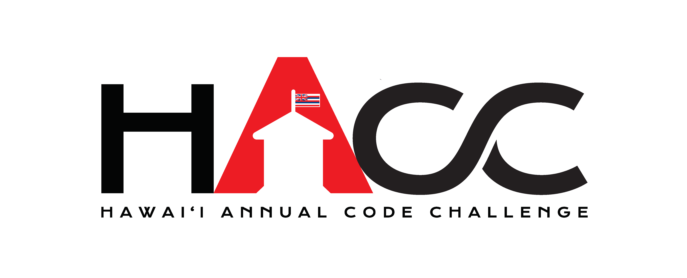
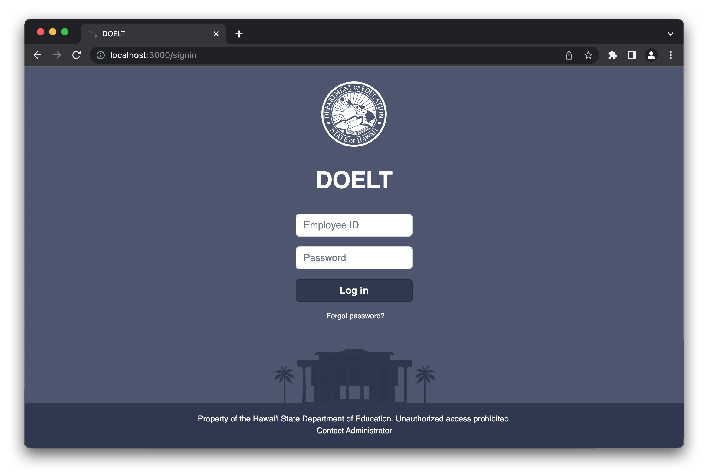
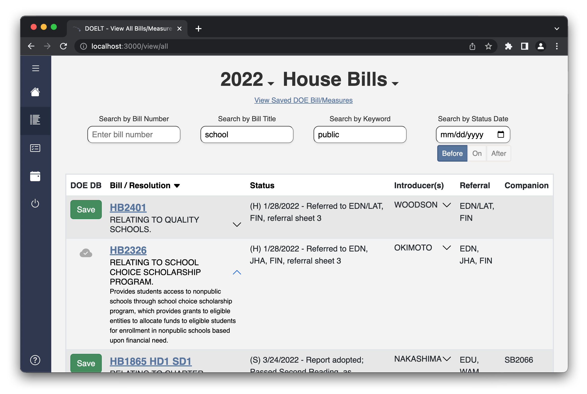
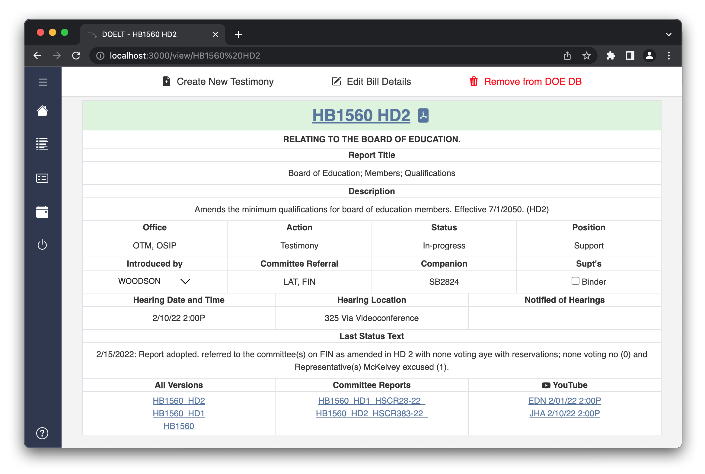
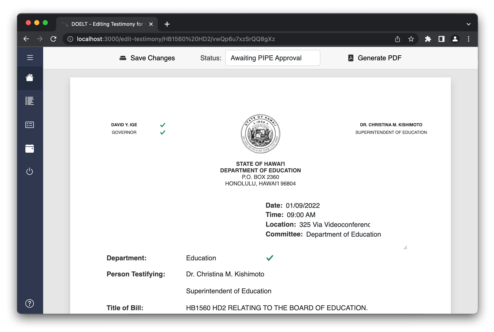

 

### About:
The Hawaii Department of Education supports our state by promoting student achievement and fostering educational excellence while ensuring equal access for all. Legislative initiatives are currently handled using a system called IBM Lotus Notes. Our application, DOE Legislative Tracker, or DOELT, modernizes the DOE's outdated tracking system by introducing a modern user interface and improving the access and usability of the system. Because DOELT is a web application, it can be accessed from any location and from any device that is connected to a network.

### Lessons
In addition to the technical knowledge, we have also acquired organizational and time management skills throughout our development process, while becoming familiar with the prerequisites and key components of the application. Furthermore, understanding our users and how we can create an application where they can be productive was crucial. Lastly, planning and prototyping an entire application was something that some of us did not have experience with, so this project was very rewarding.

 
 
 
 

### What’s Next for DOELT - DOE Legislative Tracker
The next step is building multiple levels of administrative authority, which will provide users in various positions or offices access to different application features. Additionally, we need a stronger and more comprehensive management plan for both the system and the users. To be more explicit, the administrator should have the ability to add new accounts for users, change their roles as needed, and delete accounts when users are no longer employed. The dashboard on the homepage could also be improved to give users a more customized experience depending on their role.
 
Other members: Giorgio Tran, Shin Saito, Kayla Hirano, Rob Godfrey.

 To see more about project DOELT visit the links below:
- [GitHub Repo](https://github.com/HACC2022/Cassiopeia)
- [Deployment](https://doelt-hawaii.xyz/)
- [Devpost](https://devpost.com/software/doelt)
 

 
 
