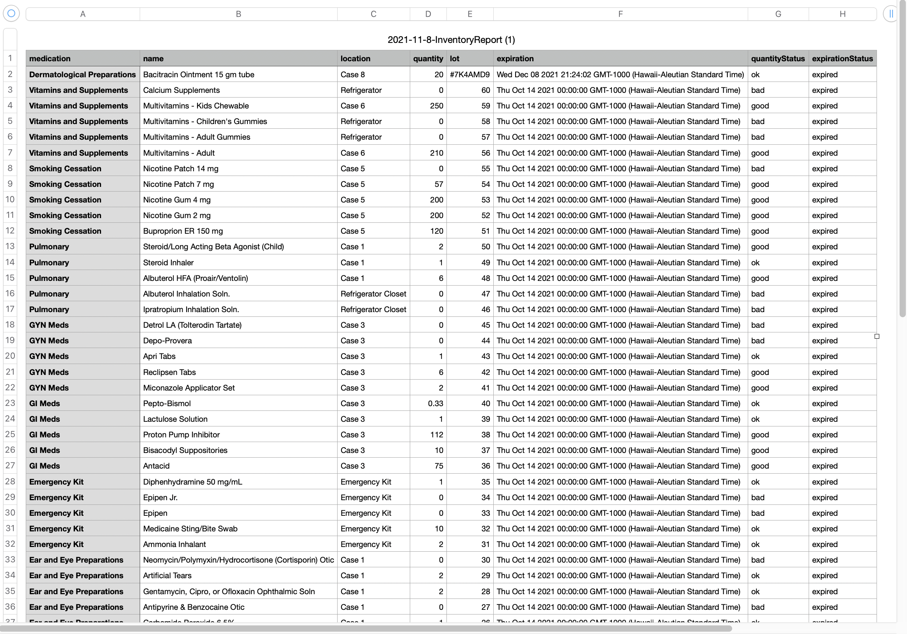

## Objective

The goal of Aeneas Medical is to create an application to aid a mobile clinic to keep track of its medications
and supplies, and have access to patients' health information.
 
## Background of the Clinic 

They are a mobile clinic that sees anywhere from 2-10 patients per half-day at various sites around the island.
Sites are variable – brick and mortar, within shelters, outdoors with pop-up tents, or in the field with backpacks
There are anywhere from 4 to 15-20 learners in clinic in any given half-day and all use our EHR, ”Athena” to document
information about patient care.
 - To read more about Hawaii H.O.M.E Project click [here](https://sites.google.com/view/hawaiihomeproject/about).

 
 
 
 

 
*Group Members:Andre Joseph Ruiz, Ana Catarina Araujo, Darnell Domingo, Jason Kaneshiro, Michael Hui, Micah Imakyure, Skyler Kimura, Tony Long.*
 
 To see more about project Aeneas visit the links below:
- [GitHub Page](https://runtime-terrorz.github.io/)
- [Deployment](https://runtime-terror.xyz/)
- [Source Code](https://github.com/Runtime-Terrorz/HOME-Project-v2)
 

 
 
