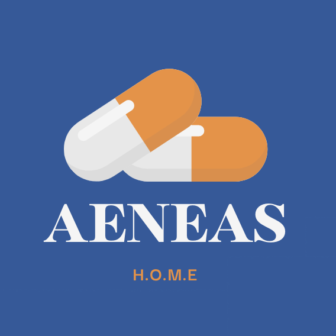
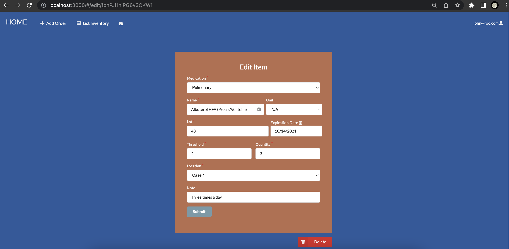
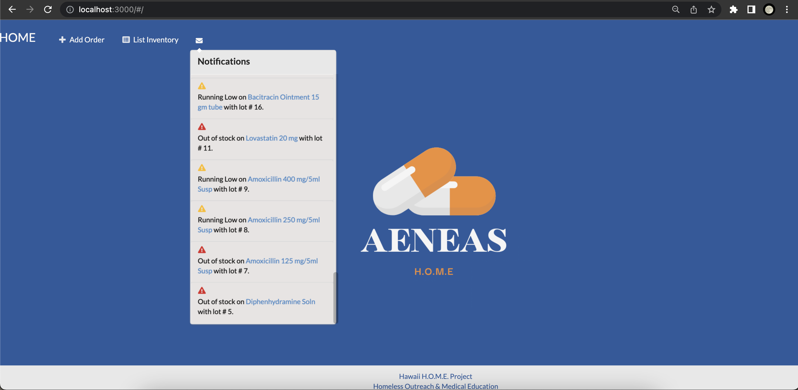

```Language(s)```: Javascript, HTLM, CSS

```Frameworks/Libraries```: React.js, Meteor.js, Semantic UI

```Database```: MongoDB

### Overview

Aeneas Medical is focused on developing a specialized application that assists mobile clinics in effectively managing their medication inventory, supplies, and patient health information. This technology aims to streamline operations and improve accessibility to healthcare services.

The Hawaii H.O.M.E. Project was established in 2005 with the objective of enhancing healthcare quality and access for individuals experiencing homelessness in Hawaii. Through student-run free clinics held at various locations across Oahu, the project provides free medical services to both sheltered and unsheltered individuals. Additionally, the project utilizes a mobile health van to reach out to unsheltered populations and organizes special events for children in shelters, with the goal of increasing awareness and understanding of the healthcare needs of the homeless community.
 - To read more about Hawaii H.O.M.E Project click [here](https://sites.google.com/view/hawaiihomeproject/about).

 <div class="text-center p-4">
 
</div>

### The App


The functionality of the Aeneas Medical application includes essential features such as sign-in/sign-up, a landing page, order management, inventory tracking, dispensing medications, low inventory reporting, and administrative capabilities. The application allows users to create and manage accounts, view log history, and receive notifications. Additional features encompassed within specific pages include search and filtering options, lot-based dispensing, role management, and the ability to remove accounts. These functionalities aim to enhance the efficiency and effectiveness of the mobile clinic in managing medications, supplies, and patient health information.

<div class="text-center p-4">
 

 







</div>

### Team
```Members```: Andre Ruiz, Darnell Domingo, Jason K., Michael Hui, Micah I., Skyler Kimura, Tony Long.

### Links
 To see more about project Aeneas visit the links below:
- [GitHub Page](https://runtime-terrorz.github.io/)
- [Source Code](https://github.com/Runtime-Terrorz/HOME-Project-v2)


