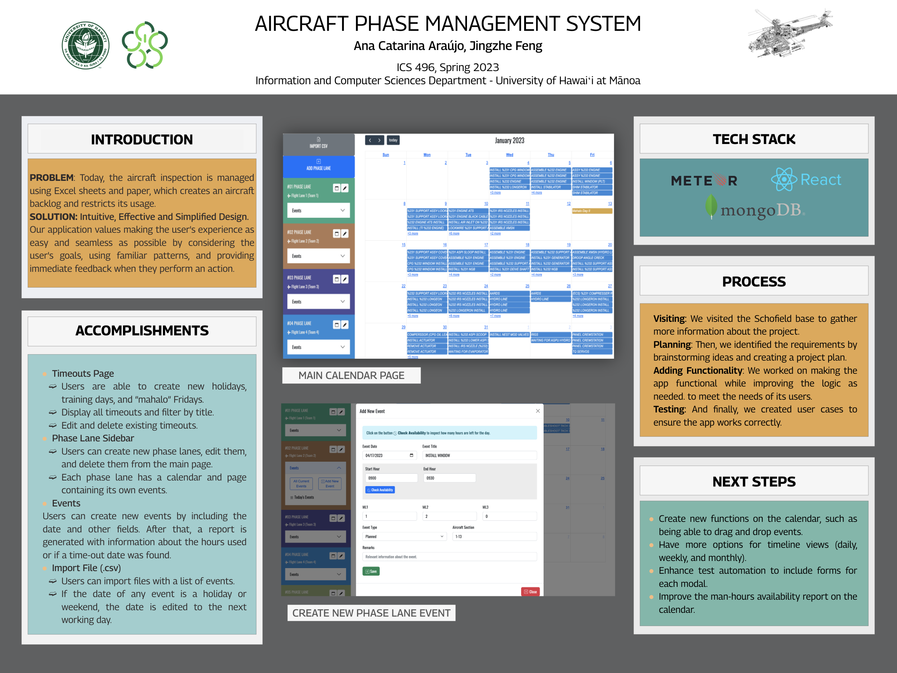
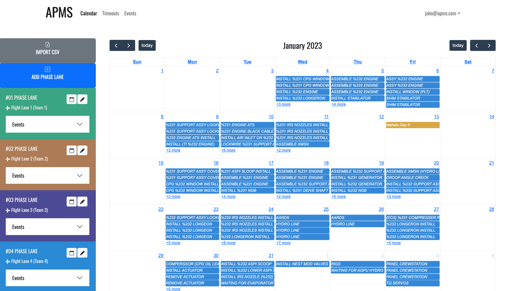
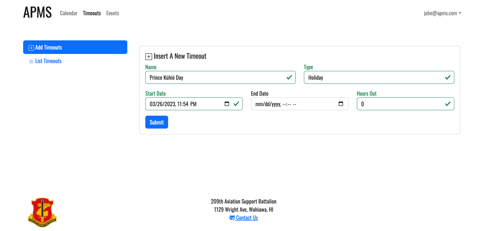
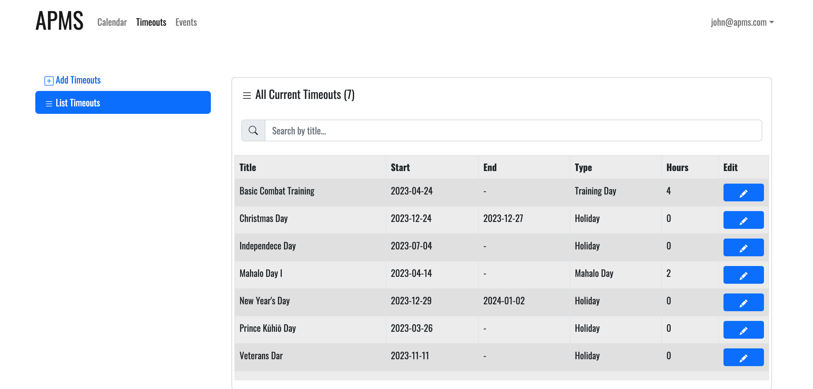
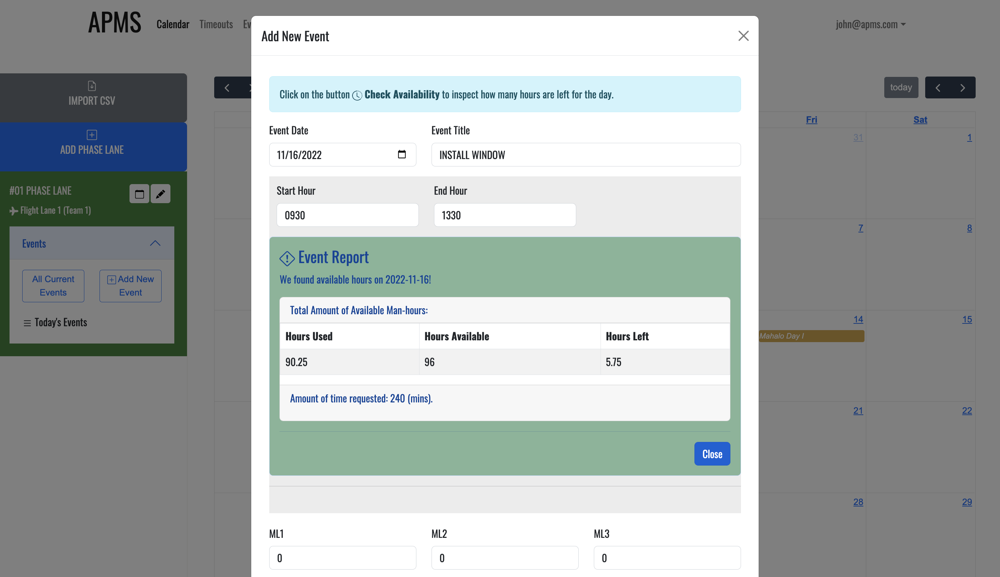

<div class="text-center p-4">
 
</div>

```Language(s)```: Javascript, HTML, CSS

```Frameworks/Libraries```: React.js, Meteor.js, Bootstrap

```Database```: MongoDB

### Current Problem

Currently, the management of aircraft operations relies on a combination of paper-based and Excel sheet systems. This outdated approach has led to challenges, such as an aircraft backlog that restricts the availability of aircraft for use.

### Our Solution
Our application prioritizes a user-friendly experience by considering the users' objectives, incorporating familiar design patterns, and delivering real-time feedback for their actions. We strive to ensure a seamless and intuitive user experience throughout the application.

**Timeouts Page**: Implemented the functionality for users to create new holidays, training days, and "mahalo" Fridays. Enabled the display and filtering of all timeouts by title. Provided the ability to edit and delete existing timeouts, enhancing user control and flexibility.

**Phase Lane Sidebar**: Developed a comprehensive feature that allows users to create, edit, and delete phase lanes directly from the main page. Each phase lane is equipped with its own calendar and dedicated page for managing associated events, providing organized and streamlined project management.

**Events**: Created a user-friendly interface for users to create new events, including essential fields such as the date. Implemented a report generation feature that presents information about hours used or identifies time-out dates, improving efficiency and decision-making.

**Import File (.csv)**: Implemented the functionality to import files containing a list of events, allowing users to easily add multiple events at once. Included automated editing of event dates that fall on holidays or weekends, adjusting them to the next working day for accurate scheduling and planning.

<div class="text-center p-4">
 
</div>

<div class="text-center p-4">
  
  
  
  
</div>

Source code not available by project sponsors.


