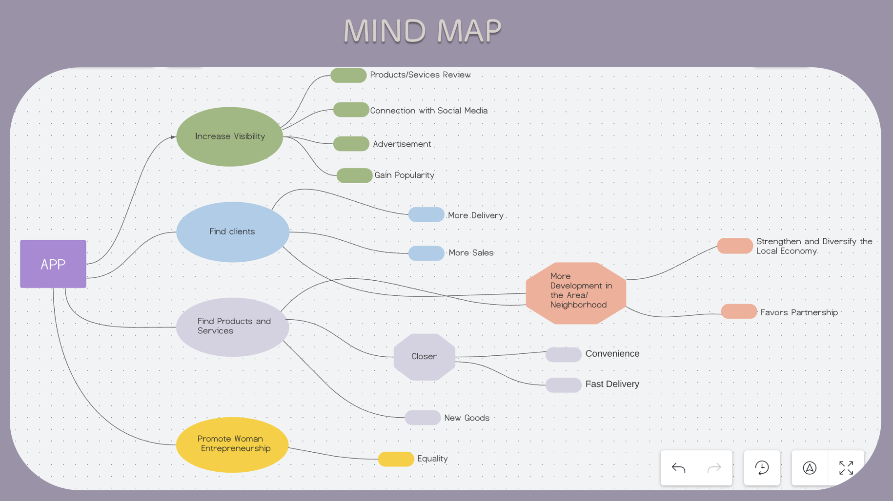
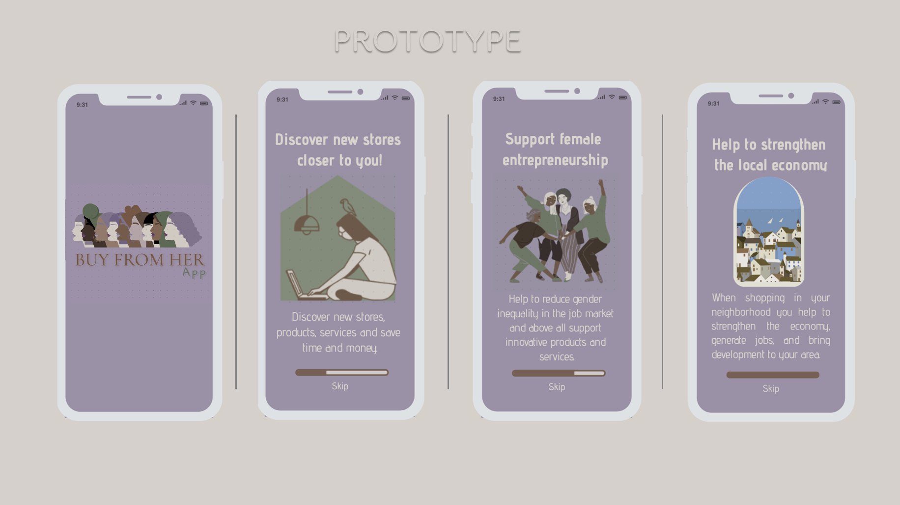
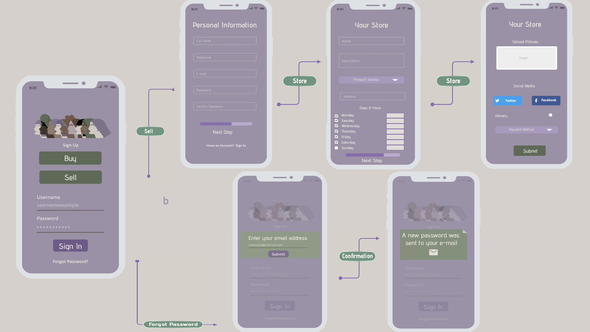
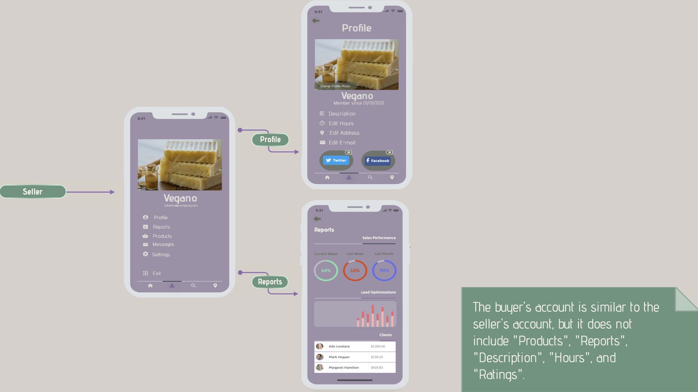
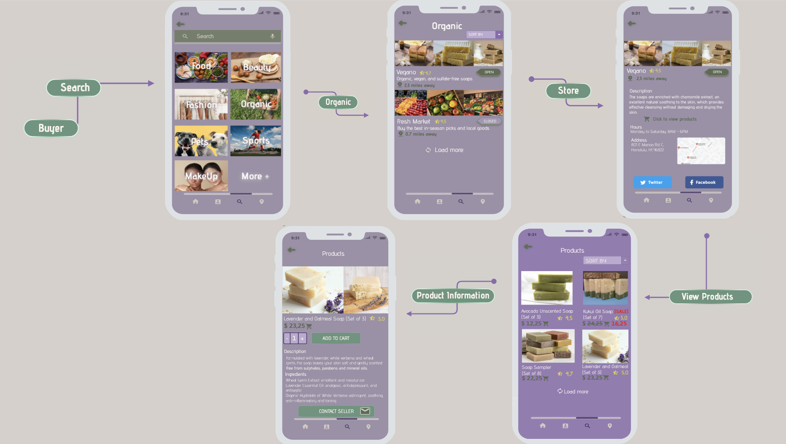
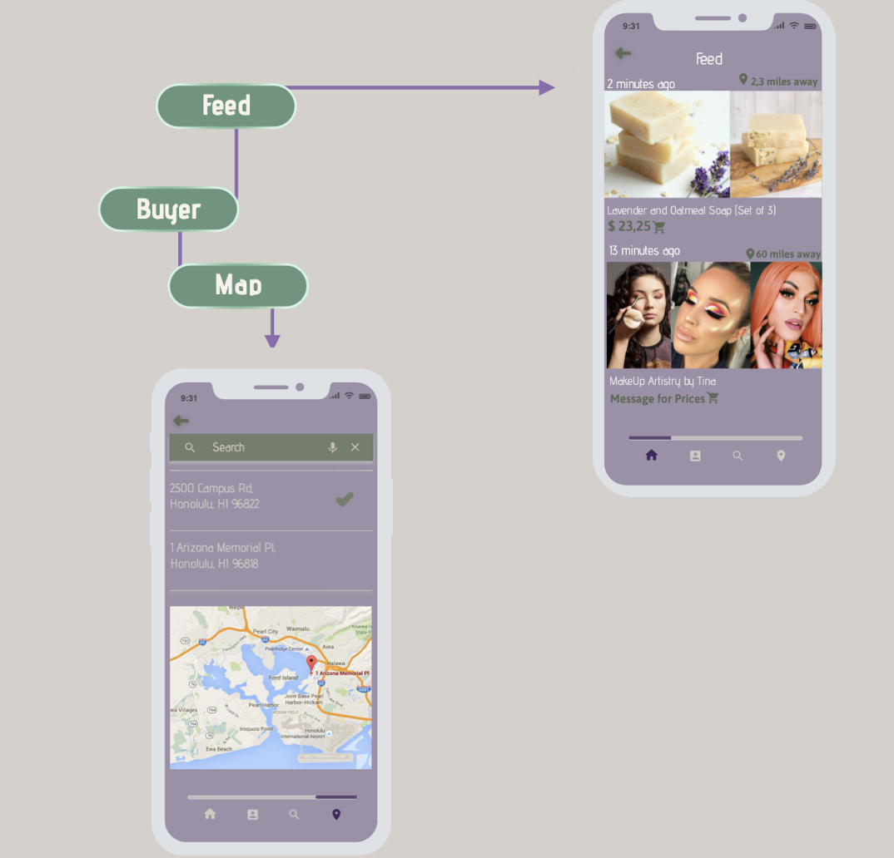

### Overview
The project focuses on supporting businesswomen by promoting their products and services, making it easier for customers to access and discover them. With the growing popularity of digital platforms, an application can effectively reach a significant portion of the population and encourage users to support local female entrepreneurs through their purchases. By providing a platform that facilitates the discovery of desired products and services without the need for extensive travel, the project has the potential to make a broader impact on enhancing accessibility and convenience for consumers.

### Motivation
This project is driven by the goal of empowering women, stimulating the growth and diversification of the local economy, creating employment opportunities, and enhancing income distribution within the neighborhood or region. By promoting the individual development of women, it aims to foster economic prosperity and social progress in the community.

### Methodology
The project was implemented using a *Top-Down* approach, which involved setting clear goals and objectives to guide its execution. Additionally, research and data gathering were conducted to gain insights into the needs and preferences of users, enabling the generation of initial ideas and strategies.

### Differential Requirements for the Project:

1. **Return Policy**: Sellers are given the choice to decline returns, but they must clearly communicate this policy to buyers before purchase.

2. **Local Buying Incentive**: Encourage local purchases by displaying the precise distance between buyers and stores, promoting convenience and supporting local businesses.

3. **Customer Reviews and Product Quality**: Prioritize businesses with favorable customer reviews and quality products over those solely based on popularity, ensuring customer satisfaction and promoting higher standards.

4. **Verification and Authentication**: Implement a thorough verification process for all stores and authenticate their products/services to prevent potential scams and maintain trust among buyers.

