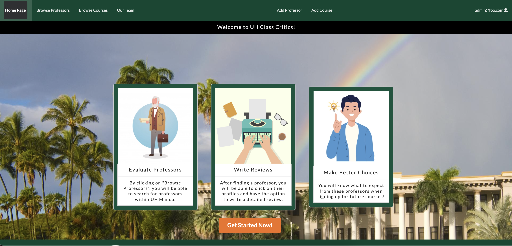

### Overview

UH Class Critics is a platform designed for students at the University of Hawaii at Manoa to share their experiences and provide reviews of various college courses and professors. It offers a valuable opportunity for students to assess their teachers and courses based on criteria that matter to them.

 ### The Problem

 The project was conceived in response to the lack of information available to students when it comes to selecting courses and professors at the start of each semester. During this crucial time, students must carefully plan and choose the courses they will undertake. UH Class Critics addresses this issue by allowing students to contribute information and reviews about courses in various disciplines such as business, health, economics, technology, marketing, and more. Accessing insights from past students who have encountered challenges in their learning journey provides a valuable advantage to any current student.

 ### The Solution

Two key features hold significant importance. Firstly, the ability to list available professors and courses, providing users with comprehensive information. Secondly, the inclusion of a review system, enabling students to share their experiences and opinions. Below, you can find two accompanying images showcasing these features.

<div class="text-center p-4">

</div>

<div class="text-center p-4">

</div>

<div class="text-center p-4">

</div>

### My Contributions

Within this website application, the Professor's page was developed to display a comprehensive list of professors retrieved from the database. Implementing search bars on both the courses' and professors' pages allowed users to quickly find the information they were seeking. To facilitate student engagement, a review section was included on the overview pages, enabling students to share their experiences and access reviews from their peers. Additionally, a dedicated page was created to provide information about the team members involved in the project. Furthermore, an administrator-level page was implemented to enable easy insertion of new courses into the database.

### What I Learned From This Experience

Throughout this project, one aspect that particularly stood out to me was the acquisition of knowledge regarding Agile Project Management. I found this management approach to be incredibly valuable, offering flexibility and ease of maintenance. By establishing tasks for each milestone, our team members were well-informed about our objectives. If any issues arose, we had the ability to adapt and make necessary adjustments. Additionally, we had the freedom to rearrange tasks according to the group's needs, prioritizing specific tasks over others.

On the whole, this experience enhanced my communication skills within the group, taught me how to break down larger tasks into smaller ones, and emphasized the importance of regularly committing changes on GitHub to avoid losing progress. Furthermore, I gained valuable insights into developing a website capable of retrieving data from a database, effectively utilizing props when interacting with the database, and recording new data entries. Additionally, I had the opportunity to work with ```underscore.js```, which proved to be immensely helpful in filtering, mapping, and sorting names, among other functionalities.

### Organization

```Team Members```: Steven Le, John Suelen, Johnny Ho, Zi Jun Huang, and I.
```Source Code```: [GitHub Link](https://github.com/uh-class-critics)
```Page``: [GitHub Page](https://uh-class-critics.github.io/)

