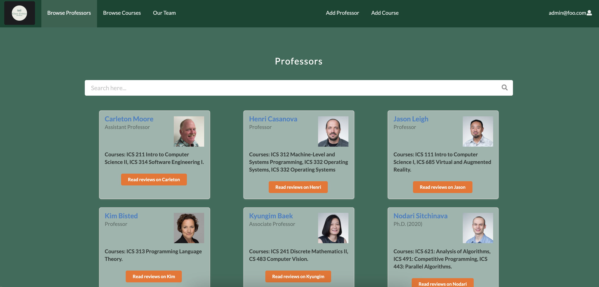
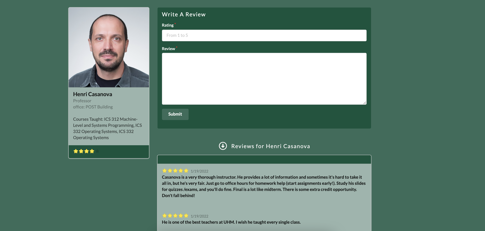

### Overview
 
UH Class Critics is a service that allows students from the University of Hawaii at Manoa to share their experiences taking different college
courses and professors and reviewing them. Students can evaluate their teachers and courses based on criteria they care about. The tool allows
students to show both positive and negative points of their university and their course.
 
 The inspiration for the project came from the lack of information when it comes to choosing courses and teachers at the beginning of each semester,
 when the student has to choose and plan carefully the courses he will take. In UH Class Critics, it is possible to include information from courses 
 in the areas of business, health, economics, technology and marketing, among others. Knowing what past students struggled to learn is a step ahead 
 for any student.

 
### Collaboration 

In this website application I have worked on the Professor's page which displays all the professors from the database. I created search bars
for the courses' page and professors' page allowing users to find quickly what they are looking for. From the overview pages, I have made a
section where students can write reviews and see reviews from other students as well. Finally, I also created a page with information about 
our team members, and for the administrator level, a page to insert new courses at database.

### What I Learned From This Experience

One of the things I enjoyed about this project was learning about Agile Project Management. I have found this method of management to 
be immensively useful, flexible, and easy to maintain. Futhermore, by setting tasks for each milestone, our group members were aware of
the things we had to do. If something did not work properly as we expect, we could adapt the issue. We could also move tasks around, decide
one task should be done before the order according to the groups needs.

Overall, I learned how to communicate better with others in the group, how to divide larger tasks into smaller ones, maintain control of 
changes and not lose progress by committing changes more often on GitHub. And of course, how to develop an website which can load data from 
a database, how props can be extremely useful when using database, record new data into a database, experience using underscore to filter, 
map and sort names, etc.
 
 Two of the most important features of this project are listing the professors and courses available, and reviewing them.
 Below there are two images demonstrating those features, one display the courses where it is possible to see ICS courses,
 and the other shows an overview of Professor Carleton Moore and pior reviews made by his students.

### Organization

[UH Class Critics](https://class-critics.xyz/#/) was designed, implemented, and maintained by our team composed of Steven Le,
John Suelen, Johnny Ho, Zi Jun Huang, and I. Our UH Class Critics GitHub Organization can also be found at here at [GitHub](https://github.com/uh-class-critics)

