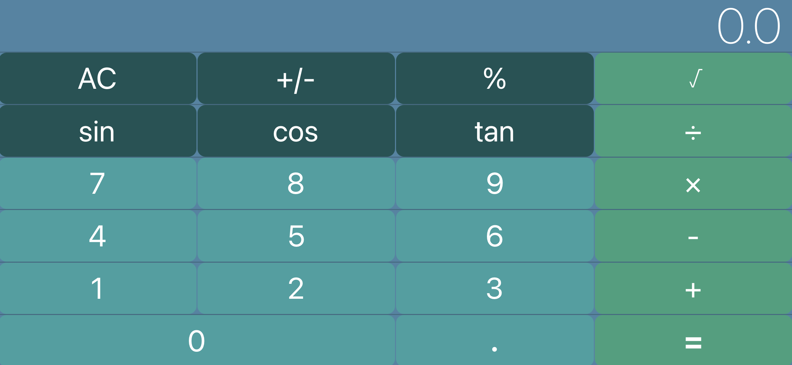

A calculator that performs the four most basic mathematical operations - addition, subtraction, multiplication and division.
In addition to sine, cos, tan and square-root. 

### What I Learned

While developing this project, I gained experience auto layering the Storyboard, and I learned how to use MVC (folder organization) 
and about the logic involved to get the calculator to work properly.

To see more about the app visit the link below:
- [Source Code](https://github.com/acatarinaoaraujo/iOS-calculator)

  
  

