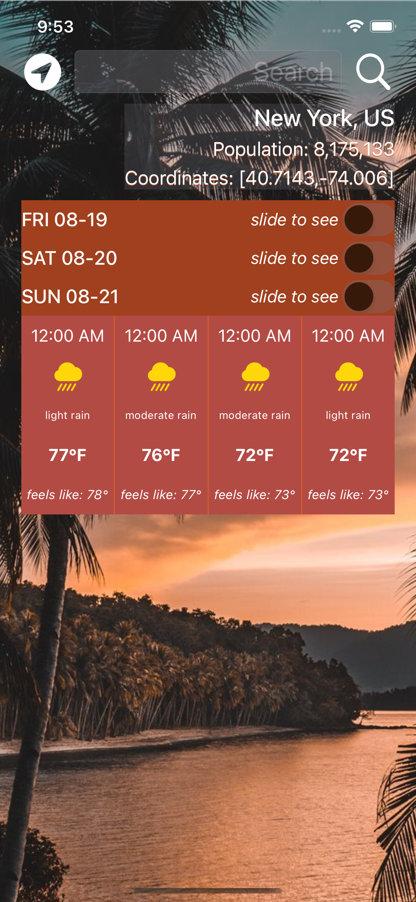

It goes without saying that we all need to be aware of the weather. Klimato 4 is a very precise weather tool you'll ever need to navigate any weather situation, including snowstorms, strong winds, sun, and rain. The app provides information about the weather for the next 4 days, and for each day, it gives the weather forecast on 4 different hours of the day.

The forecast has data about the population, coordinates, weather, and temperature of the location. This was made possible by using the [OpenWeather API](https://openweathermap.org/forecast5), where the forecast is available in JSON and XML format. 

<div class="text-center p-4">
 
  
</div>


### What I Have Learned

- **UIStackView**: You may use stack views to build user interfaces that dynamically adjust to changes in the available space, the orientation of the device, and the size of the screen. The axis property is most likely the first stack view property you will work with. It allows you to designate how the primary axis, or the axis along which the stacked subviews are placed. By setting it to either horizontal or vertical, all subviews will be forced to fit into a single row or column. This implies that stack views in iOS do not let overflowing subviews to wrap into a new row or column.

<div class="text-center p-4">
  
</div>

- **UISwitch**: The UISwitch specifies a method to regulate the switch's on/off state. The valueChanged event is triggered when the user moves the switch control just like with UISlider.

- **Delegation**: A design pattern called delegation allows a class to "delegate" some of its duties to an instance of another class. One class transfers a responsibility to another class by delegating a job to that class. This allows the delegate to alter the base class. We may create code that is considerably simpler to reuse and maintain by removing the requirement that an object understand the concrete type of its owner. When a type needs to be used in numerous contexts and has a clear owner in each of those contexts, delegation is typically a viable option. 

<div class="text-center p-4">
  
</div>

- **CLLocationManager**: We can request location permissions using CLLocationManager to get a user's location once, and when needed. 

```swift
extension WeatherViewController: CLLocationManagerDelegate {
    
    @IBAction func locationPressed(_ sender: UIButton) {
        locationManager.requestLocation()
    }
    
    func locationManager(_ manager: CLLocationManager, didUpdateLocations locations: [CLLocation]) {
        if let location = locations.last {
            locationManager.stopUpdatingLocation()
            let lat = location.coordinate.latitude
            let lon = location.coordinate.longitude
            weatherManager.fetchWeather(latitude: lat, longitude: lon)
        }
    }
}
```

- **Perform a URL Request with URLSession**: URLSession is a networking API for downloading data from and uploading data to endpoints denoted by URLs. 

- **Parse JSON**: The JSON format (JavaScript Object Notation) is great for the exchange of data due to its easily readable text form. Data is represented via arrays {...} and lists [...]:

Example of answer in JSON:

```json
{"cod":"200","message":0,"cnt":40,"list":[{"dt":1661245200,"main":{"temp":79.29,"feels_like":79.29,"temp_min":73.18,"temp_max":79.29,"pressure":1012,"sea_level":1012,"grnd_level":1008,"humidity":83,"temp_kf":3.39},"weather":[{"id":800,"main":"Clear","description":"clear sky","icon":"01n"}],"clouds":{"all":0},"wind":{"speed":0.78,"deg":285,"gust":1.07},"visibility":10000,"pop":0,"sys":{"pod":"n"},"dt_txt":"2022-08-23 09:00:00"},{"dt":1661256000,"main":{"temp":80.17,"feels_like":83.48,"temp_min":80.17,"temp_max":81.95,"pressure":1012,"sea_level":1012,"grnd_level":1010,"humidity":72,"temp_kf":-0.99},"weather":[{"id":801,"main":"Clouds","description":"few clouds","icon":"02d"}],"clouds":{"all":11},"wind":{"speed":0.72,"deg":14,"gust":1.05},"visibility":10000,"pop":0,"sys":{"pod":"d"},"dt_txt":"2022-08-23 12:00:00"},{"dt":1661655600,"main":{"temp":75.34,"feels_like":76.62,"temp_min":75.34,"temp_max":75.34,"pressure":1010,"sea_level":1010,"grnd_level":1007,"humidity":86,"temp_kf":0},"weather":[{"id":500,"main":"Rain","description":"light rain","icon":"10n"}],"clouds":{"all":29},"wind":{"speed":2.19,"deg":36,"gust":2.3},"visibility":10000,"pop":0.59,"rain":{"3h":0.24},"sys":{"pod":"n"},"dt_txt":"2022-08-28 03:00:00"},{"dt":1661666400,"main":{"temp":73.63,"feels_like":74.84,"temp_min":73.63,"temp_max":73.63,"pressure":1009,"sea_level":1009,"grnd_level":1005,"humidity":88,"temp_kf":0},"weather":[{"id":500,"main":"Rain","description":"light rain","icon":"10n"}],"clouds":{"all":19},"wind":{"speed":2.86,"deg":348,"gust":3.6},"visibility":10000,"pop":0.53,"rain":{"3h":0.56},"sys":{"pod":"n"},"dt_txt":"2022-08-28 06:00:00"}],"city":{"id":3663517,"name":"Manaus","coord":{"lat":-3.1019,"lon":-60.025},"country":"BR","population":1598210,"timezone":-14400,"sunrise":1661248923,"sunset":1661292229}}
```

Swift can scan JSON data and convert Swift values to JSON using the Foundation classes JSONDecoder and JSONEncoder. It is advised to create appropriate data types as structs that are an exact 1:1 replica of the JSON structure. These need to be acknowledged as complying with the Codable protocol.

```swift
import Foundation

struct WeatherData: Codable {
    let city: City
    let list: [List]
}

struct City: Codable {
    let name: String
    let country: String
    let population: Int
    let coord: Coordinates
}

struct Coordinates: Codable {
    let lat: Float
    let lon: Float
}

struct List: Codable {
    let main: Main
    let weather: [Weather]
    let dt_txt: String
}

struct Main: Codable {
    let temp: Float
    let feels_like: Float
    let temp_min: Float
    let temp_max: Float
}

struct Weather: Codable {
    let id: Int
    let description: String
}
```


To see more about the app visit the link below:
- [Source Code](https://github.com/acatarinaoaraujo/iOS-weather-app)
