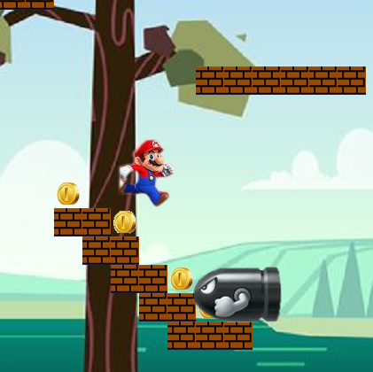

### Why Mario? 

I remember playing Mario for the first time when I was about 7 years old. Mario is the first game I have ever played. 
My brother, who is older than me, introduced me to Nintendo 64 Console somewhere around 2004. I didn't know much about
video games at the time, and even after that, I never played any games (except *Grand Theft Auto*). How could I ever imagine
that I would be creating games?! Looking now, it is kind funny that I ended up making this game about Mario with my group
partners. It is one of those things in life that we experience, and we think that we will never see them again, but they 
return in another form.

### Team Work

When Professor Jason Leigh talked about the final project for ICS 111, I immediately thought about making a game based on Mario. 
However, I did not have a group yet, I needed to invite two classmates to participate on this project and convince them about Mario.
Fortunately, my team liked my idea, and Professor Leigh gave us full autonomy for this project, as long as we used EZ Library.
My team and I began to think about how to use the tools we had to make the game work. The more tools we use, the better it is 
for us in terms of gaining practice.

We started by gathering the documentation for EZ and seeing all the methods available. Then, we applied the methods that we thought
would be useful for our project, such as *wasKeyDown(char c)*. We wanted to keep the game simple, but very similar to the original game, 
including the graphics and the main functions. We decided not to not assign the problems to each member in the group, but instead
working together on the most important aspects of the games first. After we had the functionality, we started to work on the visual 
part of the game by finding pictures for the characters, scenery, and font themes. This part is entertaining, but takes some time to 
find the perfect graphics for a game.

*First image below shows Mario trying to get all the coins.
The second image shows mario after he was hit but the bullet. GAME OVER!*

  
  

        
### Some EZ methods used in the game:

- *pullToFront ()*: Pulls the given element to the front of the layer.
We used this method for the bullet. The bullet moves in front of the
wall and scenery in a random speed. 

- *setMsg(String m)*: Displays a text to the given parameter.
This method was used for the introduction and the end of the game.

- *wasKeyDown(char c)*: Checks if a key was pressed by the user at some point.
After the introduction a key must be pressed in order to start the game.

- *isPointInElement(int x, int y)*: Checks if the x and y coordinates are within of an element.
This method was the most important method besides EZ.initialize(). To make this game function
properly we had to check if the main character, Mario, had close contact with the obstacles (bullets). 

- *moveForward(double distance)*: Moves the element ahead by the given number (distance). 
Used to move the seamless background in order to make the game more realistic. 

- *loop()*: plays a song from the start of the game to the end by repeating the song multiple times during the game.

	
First-year ICS 111 students at the University of Hawaii at Manoa has been using EZ Graphics (a Java graphics library) since 2014.
EZ aids students with no prior programming experience to manipulate graphics. EZ was created by Dylan Kobayashi.To read more about
EZ visit the url: [EZ Documentation](http://www2.hawaii.edu/~dylank/ics111/doc/).