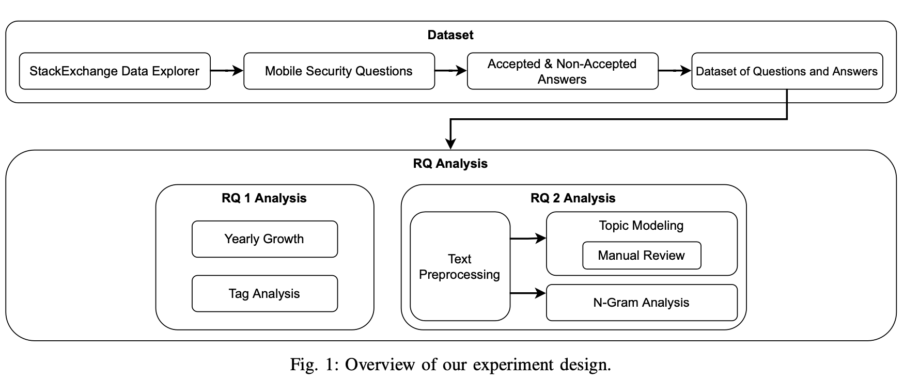
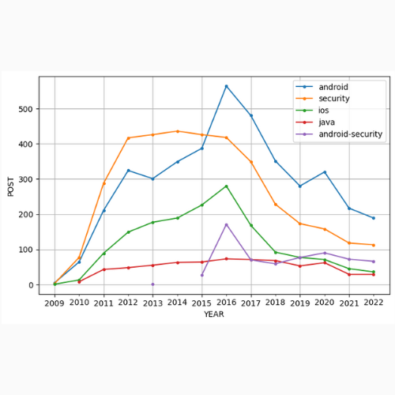
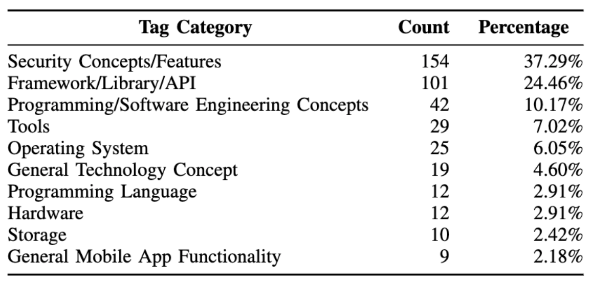
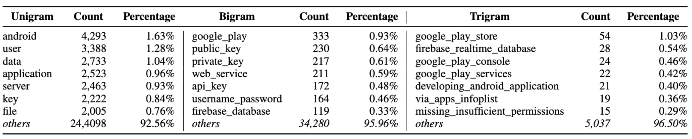
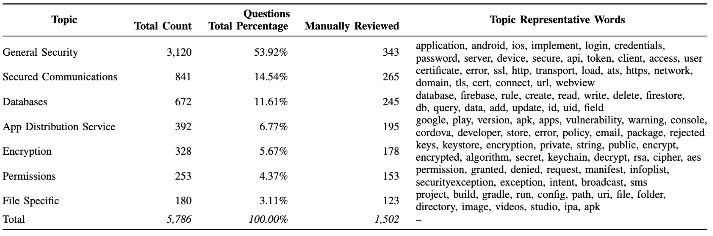

## Abstract
The widespread prevalence of smartphones and tablets has led to society’s reliance on mobile devices for accessing resources and services through the use of mobile applications (apps). As part of their functionality, many apps process, store, and transmit sensitive data, such as personal, financial, and health data, among others. Hence, app developers must take the necessary precautions to protect their apps from malicious attacks and other vulnerabilities. Though research into software security, such as malware and vulnerabilities, is widespread, little is known about the challenges developers face in troubleshooting their mobile apps’ security-related issues in a practical setting. To this extent, this paper examines the mobile app security questions developers ask on Stack Overflow. Through a combination of quantitative and qualitative techniques, we show that Stack Overflow is a popular venue for developers to ask mobile app security questions, with most questions related to Android apps. Additionally, we present that questions typically fall into seven categories Secured Communications, Database, App Distribution Service, Encryption, Permissions, File-Specific, and General Security concerns. We envision findings from this study will better educate developers on potential areas of concern when implementing/maintaining their apps and empower the research/vendor community with constructing tools/techniques to help developers secure their apps.

Fig. 1: Methodology

Fig. 2: Yearly growth of popular tags associated with mobile security questions.

Fig. 3: Breakdown of the volume of the instance for each category.

Fig. 4: Top 7 frequently occuring unigrams, bigrams and trigrams in questions.

Fig. 5: Volume of each LDA topics and reviewed by authors, and a partial set of associate words.

To see our full project, click the link below:
[Mobile Security Analysis PDF Project](https://github.com/acatarinaoaraujo/acatarinaoaraujo.github.io/blob/main/MobileSoft2023_SO_Mobile_Security.pdf)

Other collaborators: Jake Imanaka, Timothy Huo.
Professor: [Dr. Anthony Peruma](https://www.peruma.me/).

