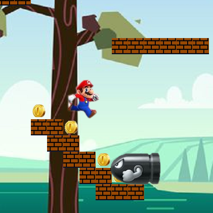
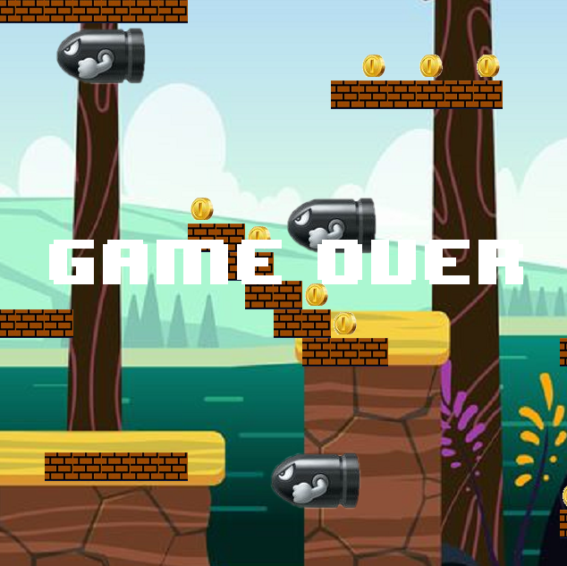

  
  

Why Mario?
  I remember playing Mario for the first time when I was about 7 years old. Mario was the first game I have ever played. My brother, who is older than me, introduced me to Nintendo 64 Console at the year of 2004. We were behind in time compared to our American counterparts. At the decade of 1990-2000, the inflation in Brazil was exorbitant, and technological devices coming from other countries received huge taxes on top of it. The minimum wage at that time was 180,00 reais (equivalent to 33,64 dolars today) and only one video game cartridge costed a little over it. So, instead of buying a new cartridge, we exchanged them with friends.

You can learn more at the [UH Micromouse Website](http://www-ee.eng.hawaii.edu/~mmouse/about.html).

