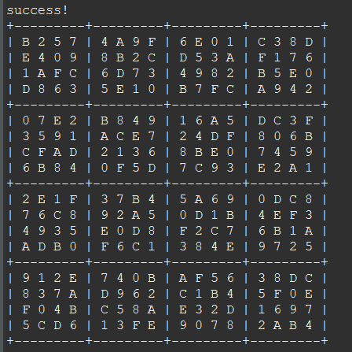
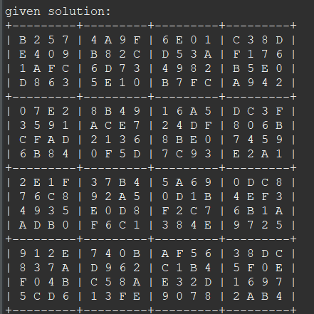
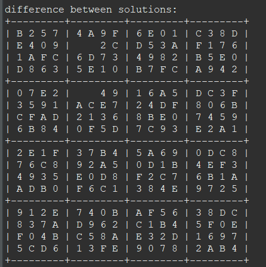

<pre>

This program is a recursive strategy to find a solution for a hexadecimal sudoku
problem. As you might know already, a Sudoku is a 9x9 grid with numbers from 1 to
9. However, in this program we have a 16x16 grid with values starting from 0 to F. 

A Sudoku is correct when the 16 rows and 16 columns in the grid has exactly one 
possible value, with a total of 16 unique values. Each small grid must also not
contain any duplicates. The problem starts with some of the grid cells already 
filled with values. After the program fills the remaining cells, it will give a
valid Sudoku. 

Strategy to the solution: 
If a value is accepted, we move the value in the cell. We must recursively try to
find a solution that fills the remaining cells. If the attempt is not successful,
the program must replace the Sudoku grid with the old value. 

</pre>

  

  
  
  
  

  
  *Source code to be released soon.*

