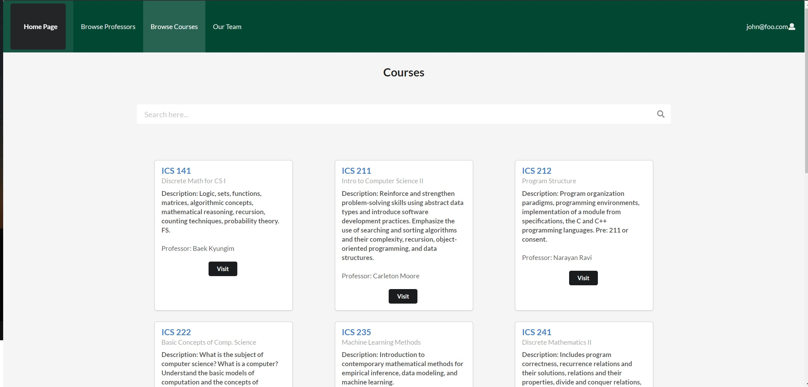
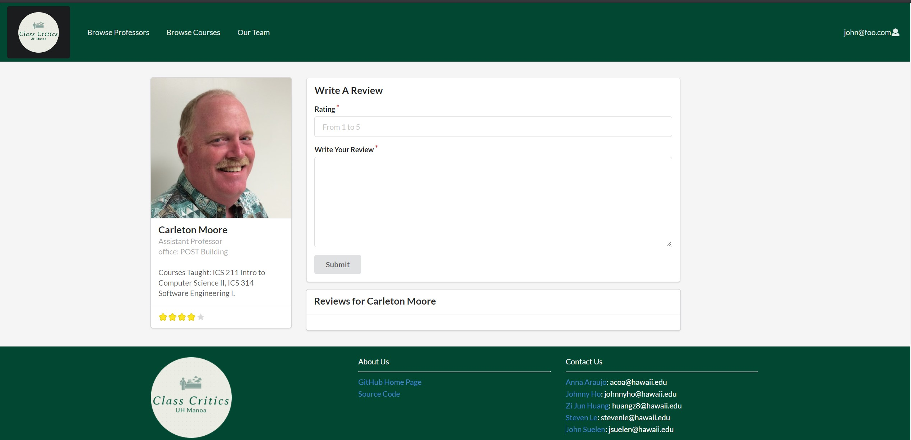

### Overview
 
UH Class Critics is a service that allows students from the University of Hawaii at Manoa to share their experiences taking different college
courses and professors and reviewing them. Students can evaluate their teachers and courses based on criteria they care about. The tool allows
students to show both positive and negative points of their university and their course.
 
 The inspiration for the project came from the lack of information when it comes to choosing courses and teachers at the beginning of each semester,
 when the student has to choose and plan carefully the courses he will take. In UH Class Critics, it is possible to include information from courses 
 in the areas of business, health, economics, technology and marketing, among others. Knowing what past students struggled to learn is a step ahead 
 for any student.

*Why Should We Review Professors and Their Courses?
A teaching strategy must always be subject to evaluation, both to improve the work for those already in the classroom and to promote the entry of 
those who are still thinking of taking a particular course.*

### Browse Courses Page

Within the Browse Courses Page, students will be able to select a course and then it will display a page that displays the course information and reviews.

### Professor Review Page

Student can write the review for a professor and rate the professor on this page. Below the Write a Review section is the previous reviews of the professor. 

### Collaboration 

In this website application I have worked on the Professor's page which displays all the professors from the database. I Created search bars
for the courses' page and professors' page allowing users to find quickly what they are looking for. From the overview pages, I have made a
section where students can write reviews and see reviews from other students as well. Finally, I also created a page with information about 
our team members, and for the administrator level, a page to insert new courses at database.

### Organization

[UH Class Critics](https://github.com/uh-class-critics/uh-class-critics) was designed, implemented, and maintained by our team composed of Steven Le,
John Suelen, Johnny Ho, Zi Jun Huang, and I. Our UH Class Critics GitHub Organization can also be found at here at [GitHub](https://github.com/uh-class-critics)

