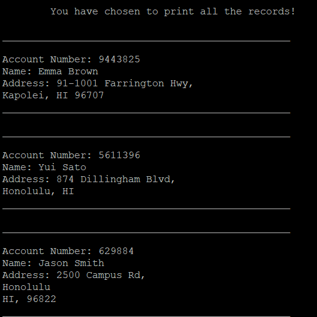

 
 
 The Bank Record Database program was developed using C and C++ while I was enrolled in ICS 212
 (Program Structure).The main purpose of this project is to aid the bank clerk in controlling 
 and managing the clients’ bank account. This program allows adding a new record into the database,
 finding a specific record (in which account number is required), deleting a given record, and 
 printing all the records in the database. Besides that, the program saves the records into a 
 text file after the user exits from it. In this way, the records are protected and can be accessible
 again when the user re-enter. It does that by writing all the records saved in the system into a file,
 and then reading the file records to save them back in the database. 
 
***Lessons Learned:***
 
This project taught me about passing by reference (address), double-pointer,
and *Singly Linked List*. But most importantly, it taught me tracing, which is essential
to be a successful programmer in C and C++. Before this program and taking ICS 212, 
I did not have experience with C/C++, and did not know how to pass by reference. 
C programming is hard, and I mean it. I had trouble using pointers, and got many *core dumps*
(segmentation fault) on the way. A Linked List can be very confusing if we do
not have well-written pseudocode or at least a scratch paper with the description of the
steps needed. Despite the frustration of dealing with pointers, I have learned a lot with
this project, and I expect to use this experience to build more sophisticated projects in
the future.
