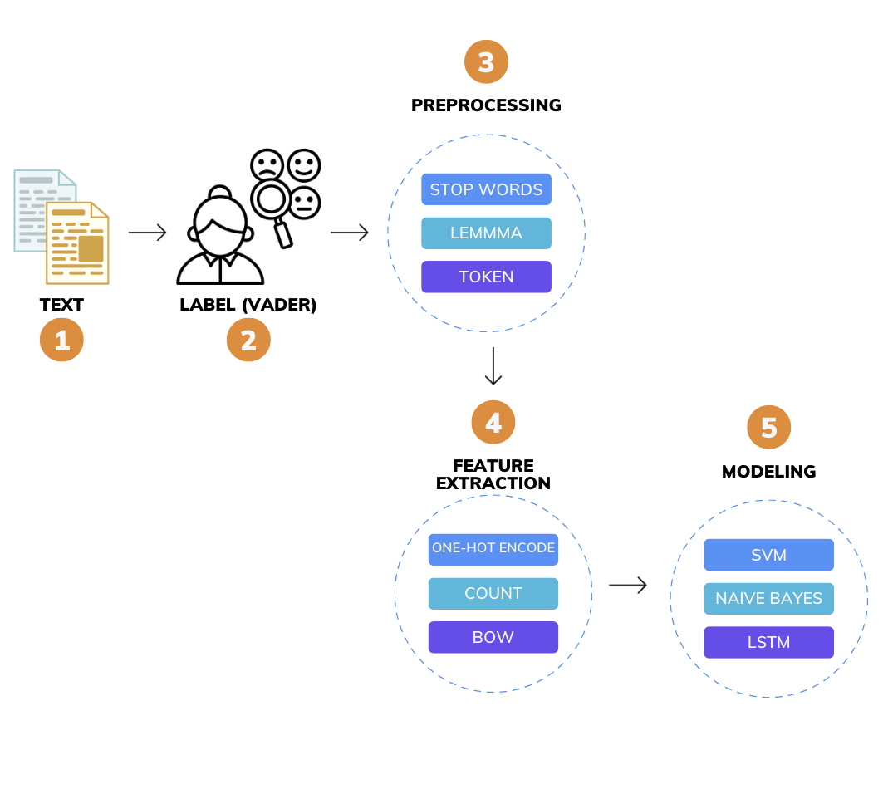
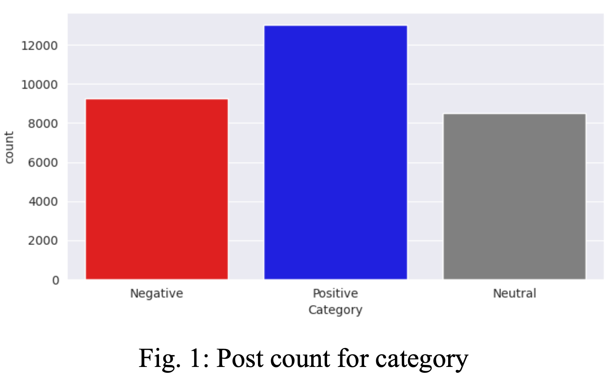
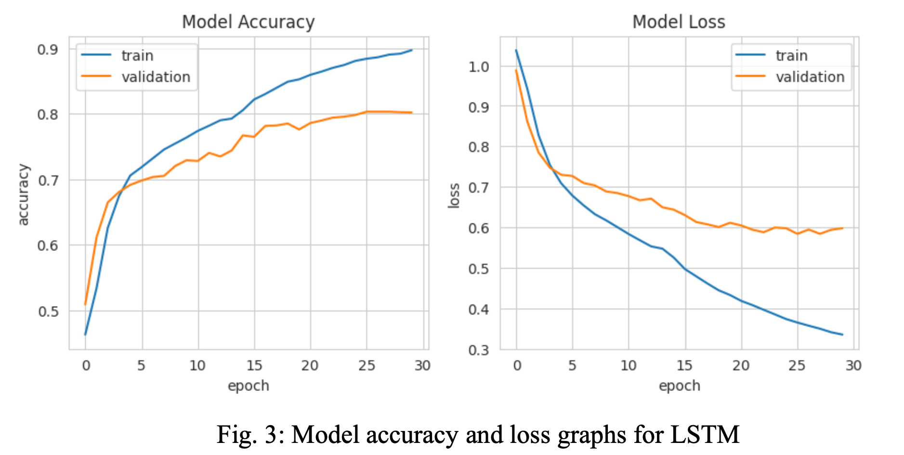
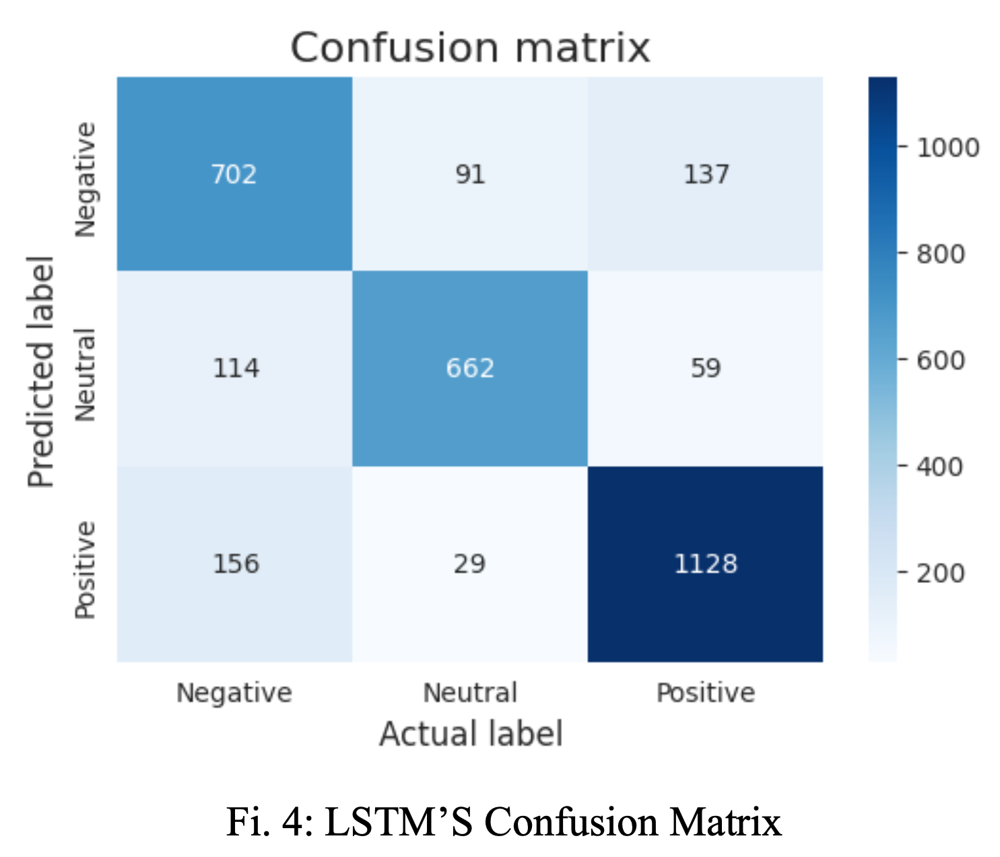

### Overview
The proliferation of social media platforms and other applications has led to an abundance of
comments and reviews related to daily life activities. As a result, sentiment-rich data in the form of tweets, comments, and reviews are being generated at an unprecedented scale. The process of collecting and analyzing people's opinions, thoughts, and feelings about various topics, products, subjects, and services is known as sentiment analysis.

### Links
**Notebook**: [AI Sentiment Analysis](https://github.com/acatarinaoaraujo/sentiment_analysis_AI/blob/main/sentiment_analysis_AI.ipynb)

### Objective
The objective of the project is to perform sentiment analysis on AI-related discussions and comments on Reddit using both conventional machine learning techniques and Long Short-Term Memory (LSTM) models. The specific goals of the project include:
3. Building and training machine learning models to accurately classify comments and posts on Reddit related to AI as positive, negative, or neutral.
3. Comparing the performance of different machine learning models, including traditional techniques and more advanced methods like LSTMs.
3. Exploring and analyzing trends in the sentiment of discussions related to AI on Reddit over time.

### Related Works
Sentiment analysis is a useful tool with many practical uses, such as product analysis,
customer sentiment analysis, and consumer satisfaction analysis. It is frequently used for market research, competitor analysis, and product analysis in the business sector as well as in the healthcare sector. Recent research has concentrated on offering comprehensive reviews of current sentiment analysis literature. For instance, Subhashini et al. (2021) published a review that covered themes including how to categorize and extract text features from opinions that are noisy or
ambiguous. Zvarevashe and Olugbara (2018) talked about the application of sentiment analysis in a variety of industries, including the stock market, healthcare, and the hospitality industry.

One of the most popular techniques is to use machine learning algorithms. Some researchers have combined machine learning algorithms including Naive Bayes, SVM, and Linear SVM with VADER, including Hajek et al. (2020) and Borg and Boldt (2020). A linear SVM model was also utilized by Li et al. (2019), who obtained excellent results with an F1 score of 83.4 percent. Additionally, Hassonah et al. (2020), whose hybrid model beat most of the models while lowering the total amount of features by up to 96%, found that hybrid models that mix machine learning and lexicon-based techniques are beneficial.
Furthermore, recent studies have compared the performance of traditional machine learning methods like Naive Bayes and Support Vector Machines with deep learning-based methods such as variants of RNN like LSTM, GRU, and Bi-LSTM in sentiment analysis. These studies have found that deep learning-based methods tend to perform better. Yadav and Vishwakarma (2020) and Wadawadagi and Pagi (2020) provide a detailed assessment of common deep learning techniques used in sentiment analysis, which include GloVe word embedding, bidirectional GRU, bidirectional LSTM, attention mechanism, and CNN. These techniques are particularly effective in capturing local features and long-term relationships.

It's challenging to make a conclusive statement about the best sentiment analysis method since performance can vary depending on factors such as the dataset, feature extraction, and evaluation metric. However, as seen above, deep learning methods are more effective than traditional machine learning methods if the data available is large enough. Additionally, hybrid models combining both machine learning and lexicon-based techniques have also shown promising results.

### Methods

3.1 **Dataset**

To extract posts and comments from Reddit, we used the Python Reddit API Wrapper (PRAW), which is a Python package that allows for easy access to the Reddit API. We targeted popular subreddits related to AI and extracted the most recent posts and comments about AI using the PRAW's built-in search function. The subreddits selected were r/learnmachinelearning, r/AskReddit, r/science, r/todayilearned, r/news, r/askscience, r/nottheonion, r/technology, r/politics. A total of 50,798 posts and their corresponding comments were collected and saved in CSV files. The data was then imported and merged to create a DataFrame. Posts with less than 7 or more than 40 words were removed, resulting in a dataset of 30,773 posts.

3.2 **Data Labeling**
VADER is a sentiment analysis tool that performs well with textual data containing emojis, slangs, and acronyms. To prepare the data for analysis, some basic preprocessing is done such as removing symbols. However, punctuation marks, capitalization, conjunctions, and preceding trigrams are not removed as they can affect the sentiment scores. Punctuation marks, such as exclamation marks, apostrophes, and question marks, can indicate the intensity of a positive or negative statement.

3.3 **Preprocessing and Feature Extraction**
Preprocessing is the initial stage in getting data ready for analysis and modeling. Data cleaning, which entails deleting unnecessary information, addressing missing numbers, and fixing inconsistencies or errors in the data, was one of the preprocessing procedures. The removal of frequent terms from a language that have no meaningful significance was the following phase, known as stop word removal. Stemming and lemmatization were then used to break down words into their simplest forms and lower the number of unique terms in the data.

The last phase involved changing the data into a form that could be easily analyzed or modelled. In this instance, text data was vectorized using methods like Bag of Words. In this method, each text is represented as a fixed-length vector of word frequencies after a lexicon of distinctive terms from the corpus is created. Another crucial stage in the methodology was tokenization, which required separating the text into tokens, or individual words. Padding was also used to ensure that each input sequence had the same length.

3.4 **Modeling**
The algorithms employed in this study were Naive Bayes, Random Forest, K Nearest Neighbor, Logistic Regression, Linear SVC, and LSTM. Scikit-learn, a Python library for machine learning, was used to implement the Naive Bayes, Random Forest, K Nearest Neighbor, Logistic Regression, and Linear SVC algorithms. For LSTM, the Keras library, built on top of TensorFlow, was used.
The preprocessed dataset was divided into training, validation, and testing sets, with a ratio of 80:10:10. Each algorithm was trained on the training set, and hyperparameter tuning was performed on the validation set to optimize their performance – code was then removed. The models' accuracy, precision, recall, and F1 score were evaluated on the testing set to determine their effectiveness in predicting sentiment.

### Results
The aim was to compare the performance of various machine learning algorithms, namely Naive Bayes, Random Forest, K Nearest Neighbor, Logistic Regression, Linear SVC, and LSTM, in predicting sentiment. The performance of each algorithm was evaluated using the F1 score, which is the harmonic mean of precision and recall. On average, the LSTM and Linear SVC algorithms emerged as the best-performing methods, with F1 scores of 0.81 and 0.80, respectively. This indicates that these algorithms were able to accurately classify the sentiment of the Reddit posts.

On the other hand, the K-nearest neighbors and Random Forest algorithms performed the worst, with F1 scores of 0.29 and 0.42, respectively. This suggests that these algorithms were not

as effective in predicting sentiment compared to the other methods. The other machine learning methods, Logistic Regression and Naive Bayes, had F1 scores in between, with 0.78 and 0.60, respectively. These algorithms were moderately effective in predicting sentiment, but not as accurate as the LSTM and Linear SVC algorithms.

### Discussion
In this project, the methods employed allowed for the extraction of relevant features for
sentiment analysis. This approach has the potential to be extended to other text classification problems. It is important to note the various challenges associated with sentiment analysis and natural language processing, such as informal writing styles, sarcasm, irony, and language-specific challenges. In conclusion, the project highlights the significant impact of the choice of machine learning algorithm on the accuracy of sentiment analysis on Reddit data related to AI. Based on the results, LSTM and Linear SVC were found to be the most suitable methods for this task.

### Future Work
Although LSTM and Linear SVC were found to be the most suitable methods for this task, there is still room for improvement in the accuracy of the results. One possible way to improve the accuracy is by using Transformers instead of LSTM. Transformers are a type of neural network architecture that has shown state-of-the-art performance in natural language processing tasks recently. They can capture the long-term dependencies and relationships between words in a sentence and have shown great success in sentiment analysis tasks.
Therefore, future work can explore the use of Transformer-based models such as BERT (Bidirectional Encoder Representations from Transformers) and GPT (Generative Pretrained Transformer). These models can potentially improve the accuracy of sentiment analysis results by capturing the context and meaning of the text data more accurately. Furthermore, future work can also explore the use of more advanced preprocessing techniques and feature extraction methods to improve the quality of the input data for sentiment analysis.

### References
1. Zvarevashe K, Olugbara OO (2018) A framework for sentiment analysis with opinion mining of hotel reviews. In: 2018 Conference on information communications technology and society (ICTAS). IEEE, pp 1–4
2. Subhashini L, Li Y, Zhang J, Atukorale AS, Wu Y (2021) Mining and classifying customer reviews: a survey. Artif Intell Rev 54:6343–6389
3. Ruffer N, Knitza J, Krusche M (2020) # Covid4Rheum: an analytical twitter study in the time of the COVID-19 pandemic. Rheumatol Int 40(12):2031–2037
4. Hajek P, Barushka A, Munk M (2020) Fake consumer review detection using deep neural networks integrating word embeddings and emotion mining. Neural Comput Appl 32(23):17259–17274
5. Borg A, Boldt M (2020) Using VADER sentiment and SVM for predicting customer response sentiment. Expert Syst Appl 162:113746
6. Hassonah MA, Al-Sayyed R, Rodan A, Ala’M AZ, Aljarah I, Faris H (2020) An efficient hybrid filter and evolutionary wrapper approach for sentiment analysis of various topics on twitter. Knowl-Based Syst 192:105353
7. Wadawadagi R, Pagi V (2020) Sentiment analysis with deep neural networks: comparative study and performance assessment. Artif Intell Rev 53:6155–6195
8. Yadav A, Vishwakarma DK (2020) Sentiment analysis using deep learning architectures: a review. Artif Intell Rev 53(6):4335–4385
9. Pal S., Ghosh S., Nag A. Sentiment analysis in the light of LSTM recurrent neural networks. International Journal of Synthetic Emotions (IJSE), 9(1), 33-39, 2018.
10. Fang, X., Zhan, J. Sentiment analysis using product review data. Journal of Big Data 2, 5 (2015).
https://doi.org/10.1186/s40537-015-0015-2

