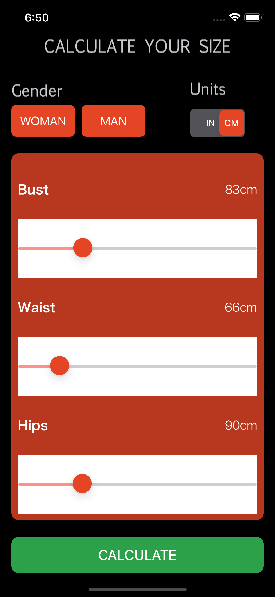

Do you know how to determine a suit's size? With our size estimator it became easy to determine your size. You can browse on the internet all types of clothing in your size after providing answers to a few questions. This application is a clothing size calculator for iOS devices. It calculates the chest, waist, and hips in cm and inches. 

### What I Learned

- **UIStoryboardSegue**: It specifies the flow of the program. In the storyboard file for a program, a segue describes the transition between two view controllers by clicking on a button, table row, or other controls linked to the segue. 
- **UISegmentedControl**: If you want to give users choices that influence the same object, state, or view, use a segmented control. A segmented control often has segments of equal width. Segments can have text or graphics, just like buttons. 

  

Interesting reading: [Reducing ambiguity on the segmented control UI design](https://uxdesign.cc/reducing-ambiguity-on-the-segmented-control-design-a5a1feef54f0)

- **UI Sliders**: By using UI Sliders you need to indicate the range of values that the slider encompasses configure the slider's appearance if desired by setting appropriate colors, and connect the slider to one or more action methods.

  

  

  

  
Dark Mode

  
  
  

To see more about the app visit the link below:
- [Source Code](https://github.com/acatarinaoaraujo/size-advisor-app)
