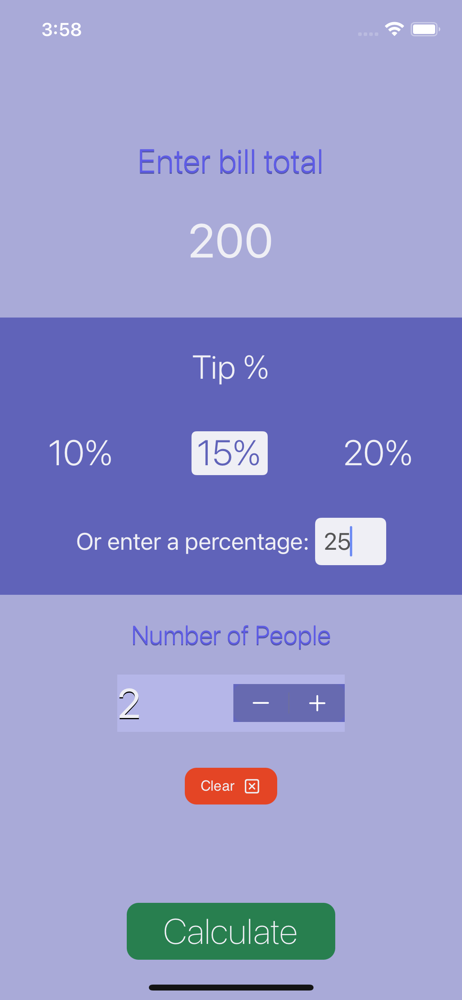

### Overview:

The iOS tip calculator application is designed to simplify the process of calculating tips on iOS devices. By focusing on essential features and accurate computations, it provides a user-friendly experience. Users can input the desired tip percentage and the number of people sharing the bill to calculate the tip amount accurately.

### What I Learned:
The development of this app served as a valuable learning experience in utilizing various iOS components such as storyboards, UIButtons, UIStoryboardSegue, UIStepper, UITapGestureRecognizer, and more. These experiences have enhanced my skills in iOS app development.

  
  
  

To see more about the app visit the link below:
- [Source Code](https://github.com/acatarinaoaraujo/tip-calculator)
