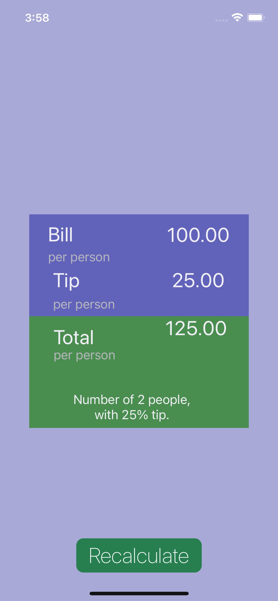

This application is a tip calculator for iOS devices. It eliminates the unnecessary features of other tip calculator apps and offers simple and accurate computations. It allows a user to calculate the tip with the desired tip percentage and number of people which the bill will be split. 

### What I Learned

This app was created to get more experience using the storyboard, UIButton, UIStoryboardSegue, UIStepper, UITapGestureRecognizer and others.

To see more about the app visit the link below:
- [Source Code](https://github.com/acatarinaoaraujo/tip-calculator)

  
  
  

